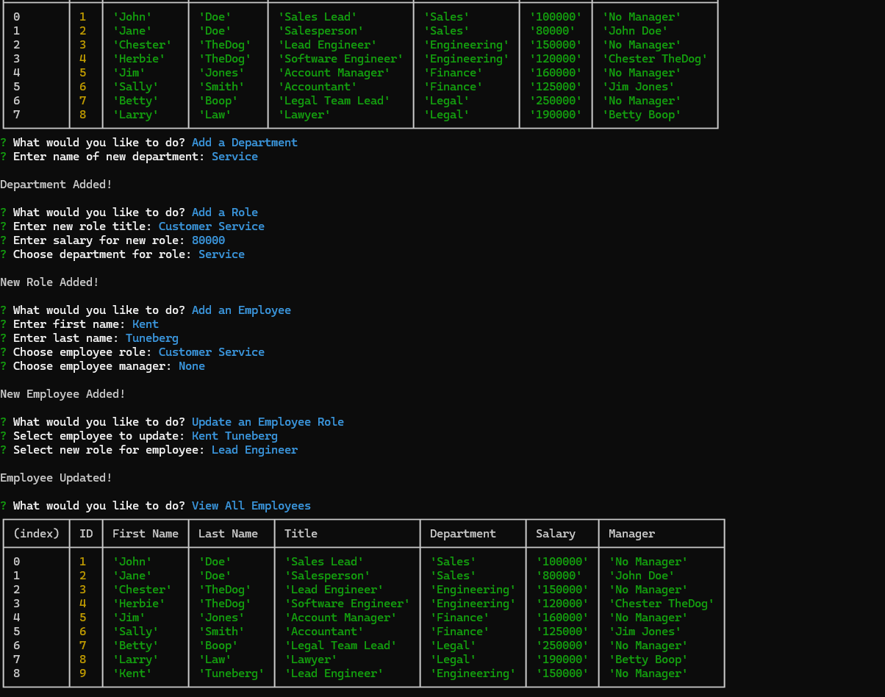

# sql-employee-db

## Description

This is a project for UW in which we were asked to create a command line application to manage a company's employee database using Node.js, Inquirer and PostgreSQL. 

## Installation

Pull the contents of this repo into a local directory. Navigate to the directory and type 'npm install' into the command line to install npm packages. 

## Usage

Type 'node index.js' into the command line to run the application. A list of options will be given to the user to view the company's employees, roles or departments; to add an employee, role or department; or to update an employee's role.  When the view options are selected, a corresponding table will show the information requested. If an add or update option is selected, the user is prompted for the information needed to fulfill the requested task. Once any option is completed, the user will be prompted with the initial list of options again. The final option, "Exit",  will end the application.

Link to video of app in use: https://drive.google.com/file/d/1LeeTP8NypZel4UzjdI0VjTMyeVNi6mLt/view

## License

N/A

## Questions

Any questions about this application should be directed to:

GitHub: https://github.com/ktunebe

Email: ktunebe@gmail.com

